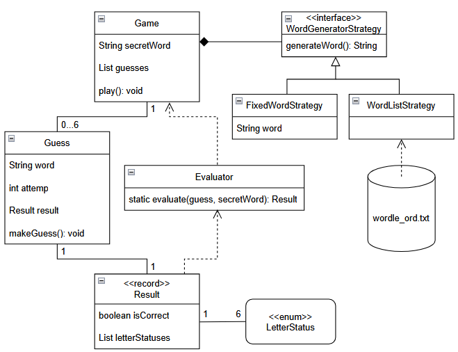

# Wordle

## Description
Wordle is a word-guessing game where the player tries to guess a hidden five-letter 
word within six attempts.

### Rules
1. The player enters a five-letter guess.
2. The game provides feedback for each letter in the guess.
   - ccc : The letter is in the correct position
   - ppp : The letter is in the word bt at a different position
   - ___ : The letter is not in the word at all
3. Each letter in the secret word kan only be matched once. For example, if the 
secret word has one "E" but the guess contains two "E"'s, only one is marked as 
correct or present.
4. The player has up to six guesses.
5. The game ends when:
   - The player guessed the word correctly (win), or
   - The player uses all attempts without success (lose)
### UML diagram
This is how the game is implemented:

  

## Getting Started
### Dependencies
- [JDK 24](https://www.oracle.com/java/technologies/javase/jdk24-archive-downloads.html)

### Executing program
To start you game of wordle run the main method in ``src/Main``.

## Help
Good luck mate 🤠🤠

## Authors
[@AmalieRosenlyst](https://github.com/AmalieRosenlyst)

## Version History
- 1.0 
  - Initial release

## Acknowledge
Developed during week 1 of [Specialisterne Academy](https://dk.specialisterne.com/en/specialisterne-academy/) at Ballerup.